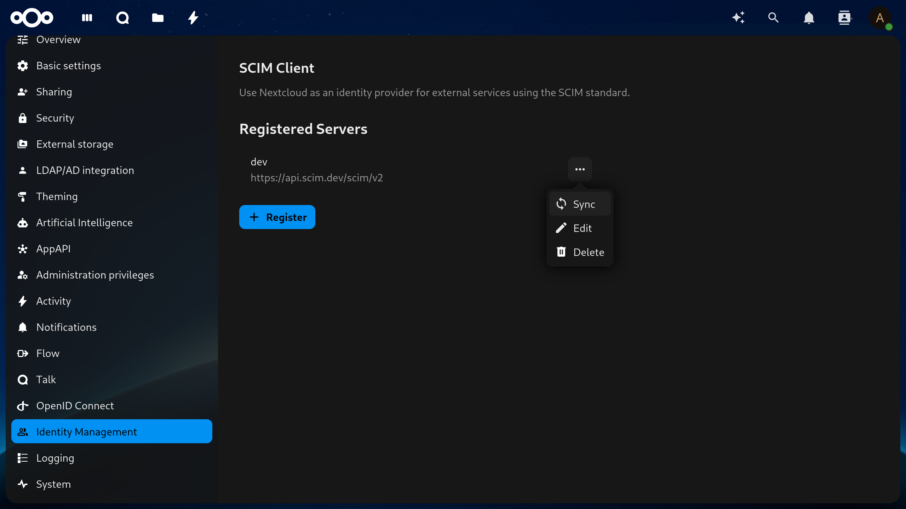

<!--
  - SPDX-FileCopyrightText: 2024 Nextcloud GmbH and Nextcloud contributors
  - SPDX-License-Identifier: AGPL-3.0-or-later
-->
# SCIM Client

Use Nextcloud as an identity provider for external services
using the [SCIM] standard.

> [!WARNING]
> This app is still under development.

With this app,
you can sync Nextcloud users and groups to any number of SCIM servers
(specified in the administration settings).
Once an SCIM server is registered,
the app will contonuously sync all Nextcloud users and groups to that server.
Any changes in user or group information
(e.g. new or deleted users and groups, changes in personal information)
will be pushed to all registered servers automatically.

## Usage

Install the app from the [App Store],
then head to **Identity Management** under the administration settings.
Click on **+ Register** and fill in the server details in the form provided.
Alternatively, you can use the `occ` command:

```sh
./occ scim_client:server:register <name> <url> <api_key>
```

Once submitted and the server details have been validated, that's it!
The app will automatically start performing a full sync for that server
in the background,
as well as push any future changes to user/group information to that server.

### Other useful commands

Clicking on **Sync** next to the desired server
also sends a background job request to Nextcloud
requesting to sync all Nextcloud users and groups to that server.
To initiate the sync immediately
without waiting for the background (cron) job to start,
use the `occ` command:

```sh
./occ scim_client:server:sync <name>
```

To list all registered servers:

```sh
./occ scim_client:server:list
```

To update one or more attributes for a registered server,
click on **Edit** next to the desired server or:

```sh
./occ scim_client:server:update [--name NAME] [--url URL] [--api-key API-KEY] [--] <name>
```

To unregister an SCIM server,
click on **Delete** next to the desired server or:

```sh
./occ scim_client:server:unregister <name>
```

## Development

To build the app from source,
clone the repository into your Nextcloud `apps` directory and run:

```sh
npm ci && npm run dev
```

From there, you can enable the app from the **Apps > Your apps** page
or by using the `occ` command:

```sh
./occ app:enable --force scim_client
```

## Screenshot



<!-- TODO: uncomment once Andy has added the REUSE headers
## License

See each individual file for details, but in general,
this project is licensed under [AGPL-3.0-or-later].

This project adheres to the [REUSE Specification].
-->

<!-- Links -->

[SCIM]: https://scim.cloud/
[App Store]: https://apps.nextcloud.com/apps/scim_client
<!-- [AGPL-3.0-or-later]: ./LICENSES/AGPL-3.0-or-later.txt -->
<!-- [REUSE Specification]: https://reuse.software/spec/ -->
